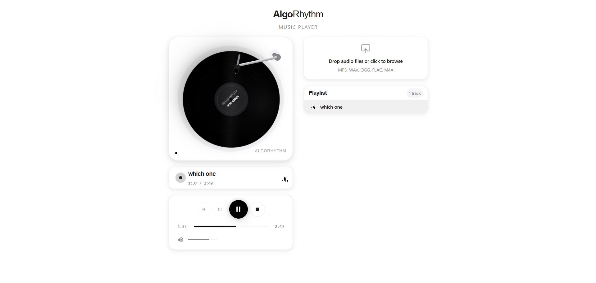

<div align="center">

# AlgoRhythm

### *Donde el vinilo renace en tu navegador*



*Un reproductor de música que recupera la experiencia ceremonial de escuchar discos de vinilo, fusionando nostalgia analógica con diseño web contemporáneo.*

</div>

---

## Filosofía de Diseño

### Combatiendo la Fatiga Digital

Las interfaces de streaming modernas nos bombardean con millones de opciones, recomendaciones algorítmicas y diseños sobrecargados. AlgoRhythm nace como respuesta a esta fatiga digital: un espacio donde recuperar la experiencia nostálgica y ceremonial de escuchar música con intención.

Este proyecto es un **homenaje a lo analógico en un mundo digital**, fusionando diseño retro con sensibilidad contemporánea. Quería devolver el ritual de poner un disco en el tocadiscos, ese momento pausado y deliberado que hemos perdido en la era del streaming infinito.

### Inspiración: Apple × Beats by Dr. Dre

De **Apple** tomé la filosofía del *"menos es más"*: el uso estratégico del espacio negativo (whitespace), las esquinas redondeadas en los contenedores para suavizar la interfaz, y una jerarquía tipográfica limpia con San Francisco/Sans-serif. Cada elemento respira.

De **Beats by Dr. Dre** incorporé la audacia y el contraste. Beats construye fondos limpios donde el producto es el protagonista absoluto. Aquí, mi "producto" es el vinilo negro sobre fondo blanco puro, creando un punto focal fuerte e inmediato.

### Diseño como Hardware Premium

No quería que esto se sintiera como "otra página web". Quería que se sintiera como un **dispositivo de hardware premium** que podrías sostener en tus manos. La metodología BEM en SCSS refleja esta obsesión por el orden: cada componente es un módulo independiente, escalable y predecible, igual que las piezas de un producto físico bien diseñado.

Porque al final, una ingeniería robusta debe ir de la mano con una estética impecable. Soy técnico, pero entiendo la importancia de la marca y la experiencia.

## Características Principales

- ** Animaciones Sincronizadas con Física Real** - El vinilo gira a 33⅓ RPM (1.8s por rotación) mientras el brazo del tocadiscos se mueve con animaciones spring de Framer Motion. Cada play/pause responde con precisión al estado de audio.

- ** Estética Monocromática Audaz** - Paleta de blanco y negro puro (#FFF/#000) que crea máximo contraste. Cada interacción está diseñada para evocar el ritual ceremonial de usar un tocadiscos físico, no solo "hacer clic en play".

- ** Diseño sin Scroll** - Toda la interfaz cabe en viewport al 100% zoom, como si sostuvieras un objeto físico. Nada se oculta, todo es inmediato y accesible.

## Stack Técnico

- **React** - Arquitectura basada en componentes para gestionar elementos independientes (DiskPlayer, Controls, Playlist) con estado y props comunicados.
- **Vite** - HMR instantáneo esencial para iterar rápidamente sobre animaciones y ajustes finos de CSS.
- **SCSS con BEM** - El diseño complejo del vinilo (gradientes radiales múltiples, sombras, keyframes) requiere mixins y anidamiento organizado.
- **Framer Motion** - Animaciones spring fluidas para el movimiento natural del brazo del tocadiscos.
- **HTML5 Audio API** - Control nativo de reproducción sincronizado con el estado visual.
- **React Context (useReducer)** - Gestión centralizada de estado para audio, playlist y sincronización global.

## Desafíos Técnicos

El mayor reto fue **sincronizar el estado de audio con las animaciones visuales**. Coordinar los event listeners de HTML5 Audio (`play`, `pause`, `ended`, `timeupdate`) con el estado de React para que el vinilo y el brazo reaccionen con precisión milimétrica requirió un manejo cuidadoso del ciclo de vida de los componentes. No podía permitir desfases ni comportamientos robóticos; cada transición debía sentirse orgánica.

El segundo desafío fue **crear un vinilo realista usando solo CSS**. Lograr surcos concéntricos, gradientes radiales múltiples, sombras internas y externas, y efectos de brillo que simulen un disco de vinilo real sin usar imágenes fue un ejercicio de paciencia. SCSS con mixins fue fundamental para mantener ese código complejo legible y mantenible, balanceando la complejidad visual con la performance del navegador.

## Instalación y Uso

```bash
git clone https://github.com/JuanJvilla09/AlgoRhtym
cd AlgoRhythm
npm install
npm run dev
```

Abre [http://localhost:5173](http://localhost:5173) en tu navegador.

## Roadmap

Este proyecto está en evolución. Tengo planes de agregar nuevas integraciones y funcionalidades que mantengan la filosofía del diseño ceremonial y minimalista. Si tienes ideas o sugerencias, son bienvenidas.

## Autor

**Mr.Nobodyelse** — Full Stack Developer Jr.

Creo que la tecnología debería sentirse tan bien como se ve. No me conformo con que "funcione". Tiene que sentirse bien.

[jjvilla1220@gmail.com]
[LinkedIn]()
[GitHub](https://github.com/JuanJvilla09)
